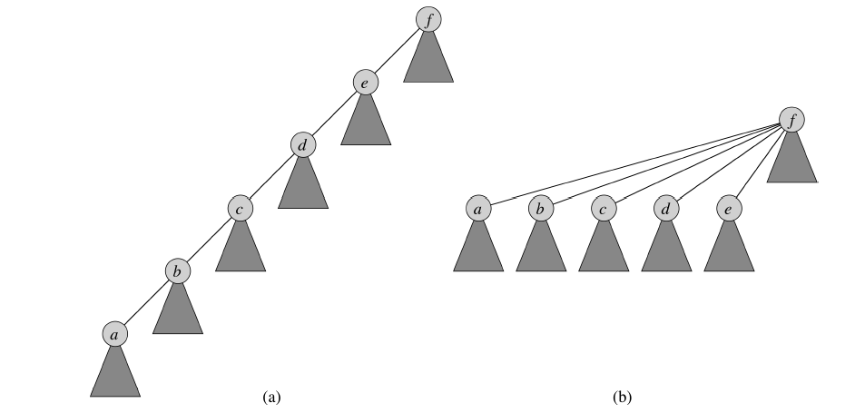
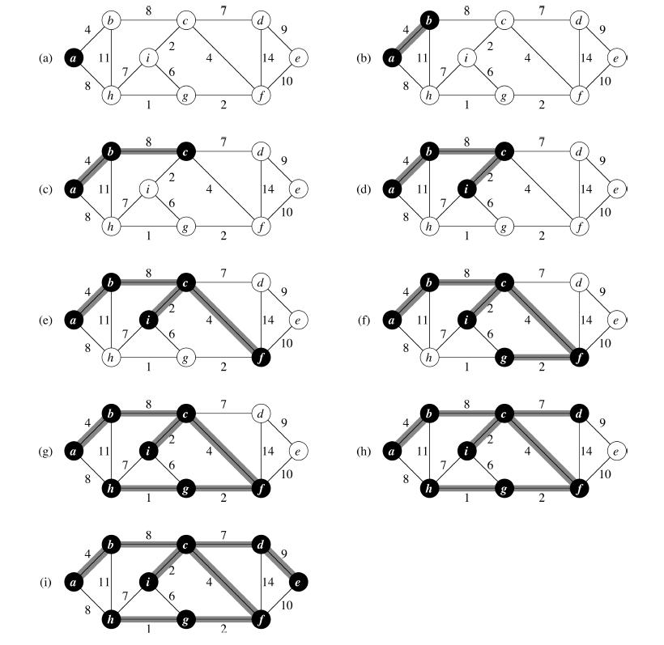

# Objective
The third part of the project consists in implementing a second method of construction of a minimal spanning tree given a connected undirected graph. 

# How to proceed
1. Implement the two acceleration heuristics and answer the question
about the rank ;
2. Implement the Prim algorithm seen in the lab;
3. test your implementation on the lecture notes example and various instances of TSP symmetric in your unit tests.

# Guidelines
Write readable, well-organized, documented and commented code. You may wish to refer to the guidelines for writing Julia code: https://docs.julialang.org/en/v1/manual/style-guide
Your methods must be documented according to the schema given in the official Julia documentation: https://docs.julialang.org/en/v1/manual/documentation
Submit your report in the form of a Pluto notebook in PDF format on Moodle and record the julia jl version on the phase X branch of your fork.
Markdown cells should guide the reader through your report.

# Notes from Slides

## Two heuristics 
Technically, the union of two related components could create long chains. In order to speed up the operations on the related components, we propose the following two heuristics:
1. union via rank ;
2. path compression.
The goal is to find the root of a tree in a forest of disjoint sets faster (in almost linear time).

## Heuristic 1 : union via rank
Each node in a forest of disjoint sets has a rank attribute whose role is to give an
role is to give an upper bound on the height of this node in its tree.

1. Initially, each node receives the rank 0 ;
2. when two sets are joined, the ranks of the roots are compared:
   * if the ranks are distinct, the root with the higher rank becomes the parent of the root of lower rank and their ranks are unchanged;
   * if the ranks are equal, one of the two roots becomes the parent of the other and its rank increases by 1.

## Heuristic 2: path compression
When searching for the root of a related component, we go from a node to its parent. The nodes and arcs thus taken form the search path.
Path compression consists in making the root the direct parent of each node on the search path of the nodes on the search path.
 
   

## Second part of this laboratory
1. Modify the disjoint set data structure to implement union via rank ;
2. show that the rank of a node will always be less than |S|-1 Then show that this rank will in fact always be less than log2(|S|) ;
3. modify the procedure for going back to the root to implement path compression.

## Prim's algorithm
Prim's algorithm accumulates edges of G = (S;A) in a single minimum spanning subtree of G and this subtree grows with each iteration. subtree of G and this subtree grows with each iteration. Any vertex not belonging to this subtree is isolated.
At each step, we add a light edge between this subtree and an isolated vertex. By the corollary of lab 3, the subtree thus obtained is still a subtree of minimum overlap.
At each step, the nodes that are part of the subtree determine a cut. The algorithm chooses a light edge that crosses this cut.
## Implementation ideas
1. Each node has a min_weight attribute which gives the weight of the edge of minimum weight connecting this node to the subtree. Initially, min_weight = Inf (i.e., +inf) ;
2. Initially, the parent of each node is nothing ;
3. the algorithm starts with a source node s chosen by the user and the attribute
min_weight attribute of s is 0 ;
4. a priority queue contains all nodes that have not yet been added to the tree and min_weight gives the priority;
5. each time a node is connected to the tree, the min_weight and attributes of those that have not yet been connected must be updated.

  

##  Third part of this laboratory
1. Implement Prim's algorithm and test it on the example of course notes;
2. Test your implementation on various instances of the symmetric TSP.
Third part of this laboratory
