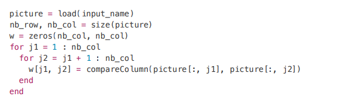

# Objectif : application

The last part of the project consists in implementing your TSP resolution method in order to reconstruct shredded images. Download the shredder.zip file available on the Moodle site for the course. It contains several directories:
*  bin contains some Julia tools;
* images/original contains several original images in PNG format;
* images/shuffled contains the same images, shredded.

The "shredded" images were created by cutting each image into a number of vertical strips and reordering these strips in random order. The strips are of constant width

The goal of this phase is to reconstruct the images as best as possible. This can be done using the TSP by imagining that each vertical band represents a node of the complete graph, and the weight of each edge is a measure of dissimilarity between two vertical bands. The idea is to assume that in the original image, two adjacent bands are very similar, i.e., not very dissimilar. We thus look for a simple path of maximum length through the nodes of the graph, which is also of minimal weight. As we have seen in class, this problem is equivalent to the TSP.

To formulate the problem as a TSP, a 
dummy node (number zero) was added as well as a zero weight edge connecting this dummy node to every other node of the graph. By searching for a minimal tour on this modified graph, then removing the zero node, we obtain the path we are looking for.
# Modules Julia
 You will need to install the following Julia modules:
* FileIO
*  Images
* ImageView
*  ImageMagick

# Method 
For each shredded image, a tsp file has already been created for you in the tsp/instances directory. These tsp files must be read with your updated version of read_stsp.jl
(which reads the weights of the edges). The data field of the nodes will simply be the node index.

Alternatively, you can read a shredded image yourself and get the dissimilarity between each pair of columns using the commands :

  

Once a tour has been identified, construct a list of nodes along that tour without removing the
the zero node. Using the write_tour() function, create a .tour file in TSPLib format that
describes your tour. Sample .tour files are available in the tsp/tours directory
directory; these have been identified by a TSP solving method, but do not necessarily give an
necessarily give an optimal solution.
Given a .tour file, we obtain the corresponding reconstructed image using the function
reconstruct_picture() . This function assumes that the tour given by the .tour file
file starts at node 0.
It is up to you to create your .tour files using your implementation of RSL and HK and to generate the
corresponding reconstructed images. Play with all the parameters you want to try to get the best
to try to get the best reconstruction possible.
For each reconstructed image, give the length of the best tour found, the original image
and the reconstructed image side by side.

